+++
title = "数据流设计"
description = "了解 biliup 系统中的完整数据流转过程"
date = 2025-01-10T00:00:00+00:00
updated = 2025-01-10T00:00:00+00:00
draft = false
weight = 50
template = "docs/page.html"

[extra]
lead = "本文档详细说明 biliup 系统中录制、上传、任务管理等核心流程的数据流转机制，以及日志和事件的传递方式。"
toc = true
top = false
+++

## 概述

biliup 的数据流涉及多个层次和组件之间的交互：

- **用户操作流**: 用户通过前端界面触发操作
- **录制流程**: 从检查直播状态到下载视频流
- **上传流程**: 从视频文件到 Bilibili 平台
- **状态同步流**: 任务状态在各组件间的同步
- **日志传递流**: 日志从 Python 引擎到前端的传递

## 用户操作流

用户在前端界面进行操作，触发一系列的数据流转。

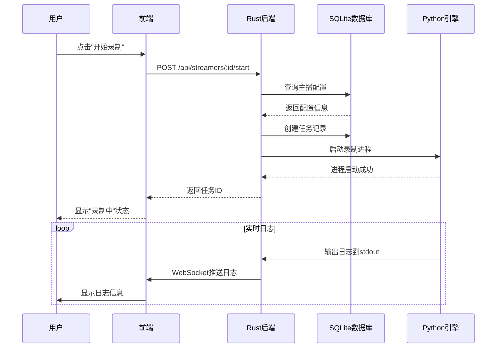
```mermaid
sequenceDiagram
    participant U as 用户
    participant F as 前端
    participant B as Rust后端
    participant D as SQLite数据库
    participant P as Python引擎
    
    U->>F: 点击"开始录制"
    F->>B: POST /api/streamers/:id/start
    B->>D: 查询主播配置
    D-->>B: 返回配置信息
    B->>D: 创建任务记录
    B->>P: 启动录制进程
    P-->>B: 进程启动成功
    B-->>F: 返回任务ID
    F-->>U: 显示"录制中"状态
    
    loop 实时日志
        P->>B: 输出日志到stdout
        B->>F: WebSocket推送日志
        F->>U: 显示日志信息
    end
```

### 操作类型

#### 1. 创建主播配置

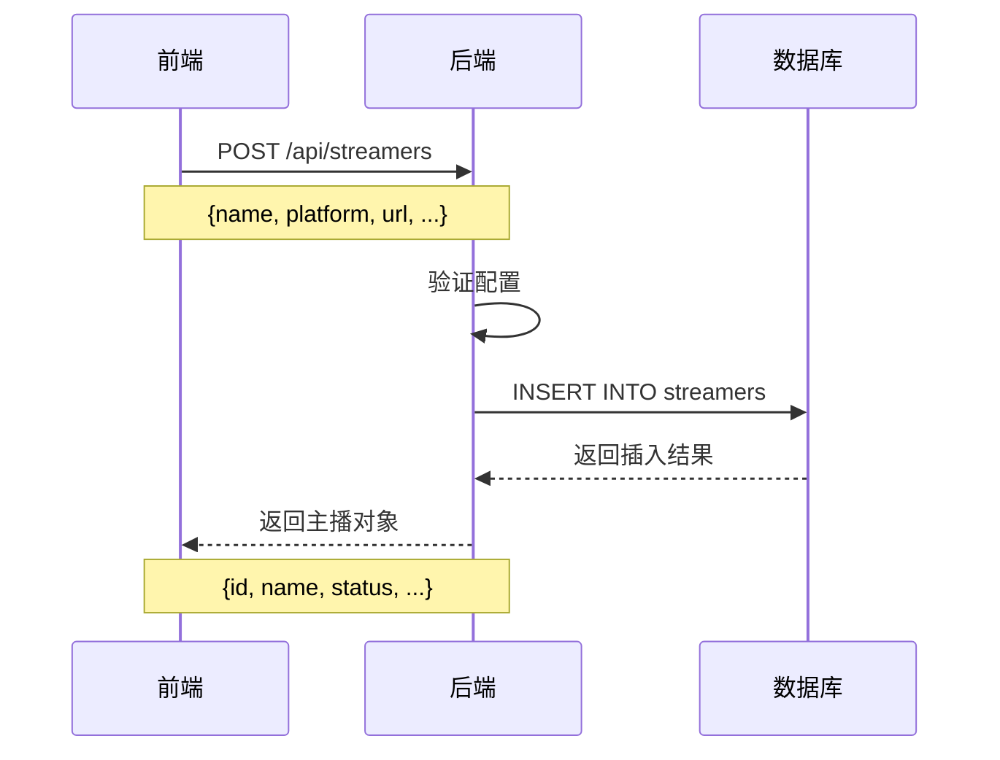
```mermaid
sequenceDiagram
    participant F as 前端
    participant B as 后端
    participant D as 数据库
    
    F->>B: POST /api/streamers
    Note over F,B: {name, platform, url, ...}
    B->>B: 验证配置
    B->>D: INSERT INTO streamers
    D-->>B: 返回插入结果
    B-->>F: 返回主播对象
    Note over B,F: {id, name, status, ...}
```

#### 2. 启动录制任务

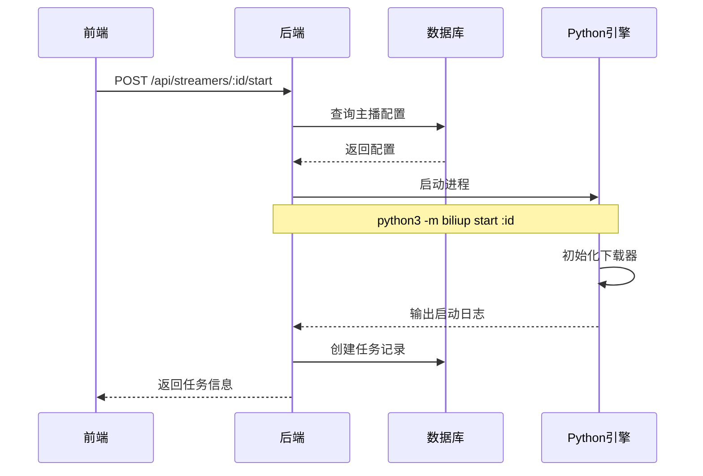
```mermaid
sequenceDiagram
    participant F as 前端
    participant B as 后端
    participant D as 数据库
    participant P as Python引擎
    
    F->>B: POST /api/streamers/:id/start
    B->>D: 查询主播配置
    D-->>B: 返回配置
    B->>P: 启动进程
    Note over B,P: python3 -m biliup start :id
    P->>P: 初始化下载器
    P-->>B: 输出启动日志
    B->>D: 创建任务记录
    B-->>F: 返回任务信息
```

#### 3. 停止录制任务

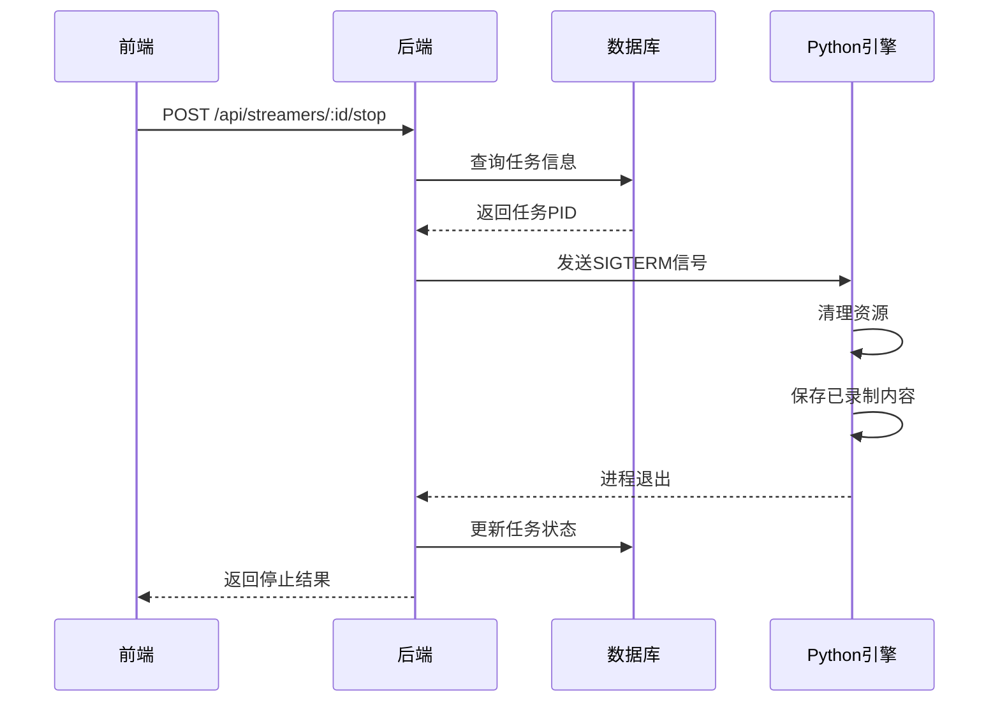
```mermaid
sequenceDiagram
    participant F as 前端
    participant B as 后端
    participant D as 数据库
    participant P as Python引擎
    
    F->>B: POST /api/streamers/:id/stop
    B->>D: 查询任务信息
    D-->>B: 返回任务PID
    B->>P: 发送SIGTERM信号
    P->>P: 清理资源
    P->>P: 保存已录制内容
    P-->>B: 进程退出
    B->>D: 更新任务状态
    B-->>F: 返回停止结果
```

## 录制流程

录制流程是 biliup 的核心功能，包含直播状态检查、流下载、分段处理等步骤。

### 完整录制流程

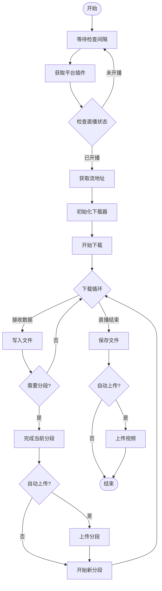
```mermaid
flowchart TD
    Start([开始]) --> CheckInterval[等待检查间隔]
    CheckInterval --> GetPlugin[获取平台插件]
    GetPlugin --> CheckLive{检查直播状态}
    
    CheckLive -->|未开播| CheckInterval
    CheckLive -->|已开播| GetStreamURL[获取流地址]
    
    GetStreamURL --> InitDownloader[初始化下载器]
    InitDownloader --> StartDownload[开始下载]
    
    StartDownload --> DownloadLoop{下载循环}
    DownloadLoop -->|接收数据| WriteFile[写入文件]
    WriteFile --> CheckSegment{需要分段?}
    
    CheckSegment -->|是| FinishSegment[完成当前分段]
    FinishSegment --> AutoUpload{自动上传?}
    AutoUpload -->|是| UploadSegment[上传分段]
    AutoUpload -->|否| NewSegment[开始新分段]
    UploadSegment --> NewSegment
    NewSegment --> DownloadLoop
    
    CheckSegment -->|否| DownloadLoop
    
    DownloadLoop -->|直播结束| SaveFile[保存文件]
    SaveFile --> FinalUpload{自动上传?}
    FinalUpload -->|是| UploadFinal[上传视频]
    FinalUpload -->|否| End([结束])
    UploadFinal --> End
```

### 详细时序图

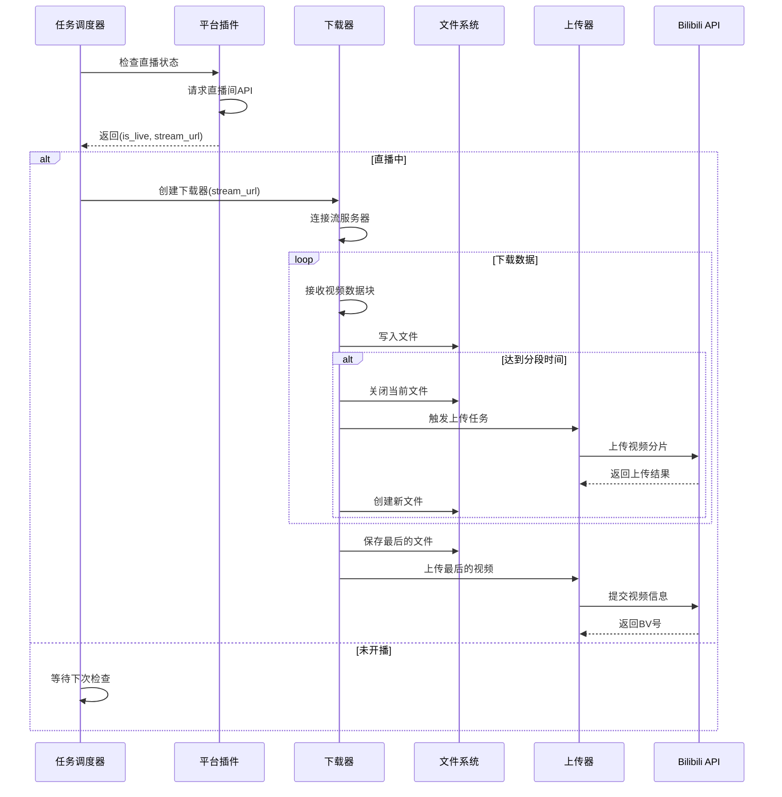
```mermaid
sequenceDiagram
    participant S as 任务调度器
    participant P as 平台插件
    participant D as 下载器
    participant F as 文件系统
    participant U as 上传器
    participant B as Bilibili API
    
    S->>P: 检查直播状态
    P->>P: 请求直播间API
    P-->>S: 返回(is_live, stream_url)
    
    alt 直播中
        S->>D: 创建下载器(stream_url)
        D->>D: 连接流服务器
        
        loop 下载数据
            D->>D: 接收视频数据块
            D->>F: 写入文件
            
            alt 达到分段时间
                D->>F: 关闭当前文件
                D->>U: 触发上传任务
                U->>B: 上传视频分片
                B-->>U: 返回上传结果
                D->>F: 创建新文件
            end
        end
        
        D->>F: 保存最后的文件
        D->>U: 上传最后的视频
        U->>B: 提交视频信息
        B-->>U: 返回BV号
    else 未开播
        S->>S: 等待下次检查
    end
```

## 上传流程

上传流程将录制的视频文件上传到 Bilibili 平台。

### 上传流程图

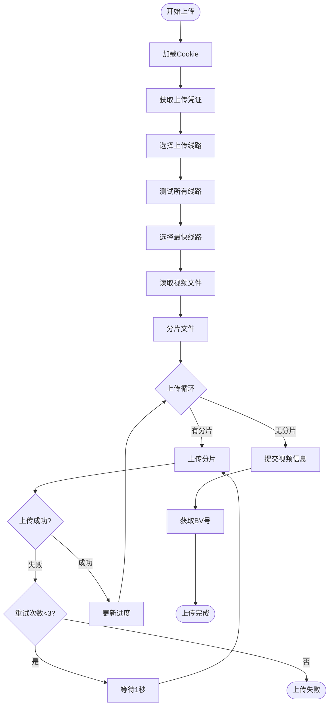
```mermaid
flowchart TD
    Start([开始上传]) --> LoadCookies[加载Cookie]
    LoadCookies --> GetCredential[获取上传凭证]
    
    GetCredential --> SelectLine[选择上传线路]
    SelectLine --> TestLines[测试所有线路]
    TestLines --> ChooseFastest[选择最快线路]
    
    ChooseFastest --> ReadFile[读取视频文件]
    ReadFile --> SplitChunks[分片文件]
    
    SplitChunks --> UploadLoop{上传循环}
    UploadLoop -->|有分片| UploadChunk[上传分片]
    UploadChunk --> CheckResult{上传成功?}
    
    CheckResult -->|失败| Retry{重试次数<3?}
    Retry -->|是| Wait[等待1秒]
    Wait --> UploadChunk
    Retry -->|否| Error([上传失败])
    
    CheckResult -->|成功| UpdateProgress[更新进度]
    UpdateProgress --> UploadLoop
    
    UploadLoop -->|无分片| SubmitInfo[提交视频信息]
    SubmitInfo --> GetBVID[获取BV号]
    GetBVID --> End([上传完成])
```

### 上传时序图

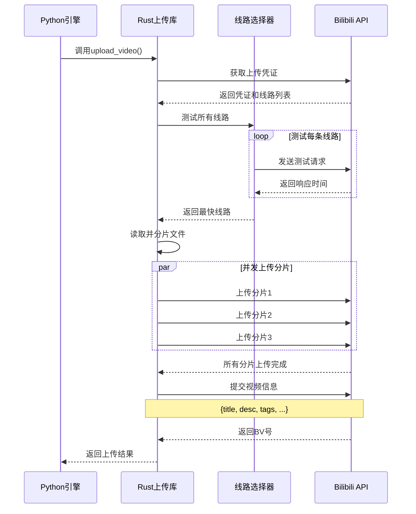
```mermaid
sequenceDiagram
    participant P as Python引擎
    participant R as Rust上传库
    participant L as 线路选择器
    participant B as Bilibili API
    
    P->>R: 调用upload_video()
    R->>B: 获取上传凭证
    B-->>R: 返回凭证和线路列表
    
    R->>L: 测试所有线路
    loop 测试每条线路
        L->>B: 发送测试请求
        B-->>L: 返回响应时间
    end
    L-->>R: 返回最快线路
    
    R->>R: 读取并分片文件
    
    par 并发上传分片
        R->>B: 上传分片1
        R->>B: 上传分片2
        R->>B: 上传分片3
    end
    
    B-->>R: 所有分片上传完成
    
    R->>B: 提交视频信息
    Note over R,B: {title, desc, tags, ...}
    B-->>R: 返回BV号
    R-->>P: 返回上传结果
```

### 边录边传流程

边录边传模式下，视频不落盘直接上传，节省磁盘空间。

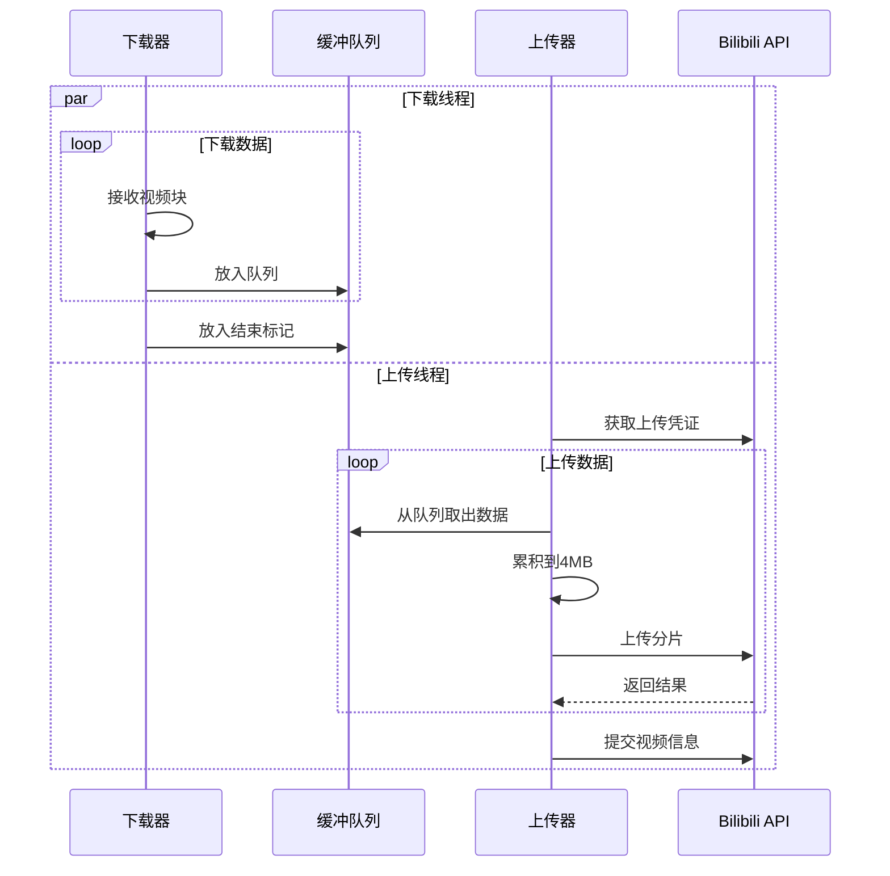
```mermaid
sequenceDiagram
    participant D as 下载器
    participant Q as 缓冲队列
    participant U as 上传器
    participant B as Bilibili API
    
    par 下载线程
        loop 下载数据
            D->>D: 接收视频块
            D->>Q: 放入队列
        end
        D->>Q: 放入结束标记
    and 上传线程
        U->>B: 获取上传凭证
        loop 上传数据
            U->>Q: 从队列取出数据
            U->>U: 累积到4MB
            U->>B: 上传分片
            B-->>U: 返回结果
        end
        U->>B: 提交视频信息
    end
```

## 任务状态流转

任务在整个生命周期中会经历多个状态。

### 状态转换图

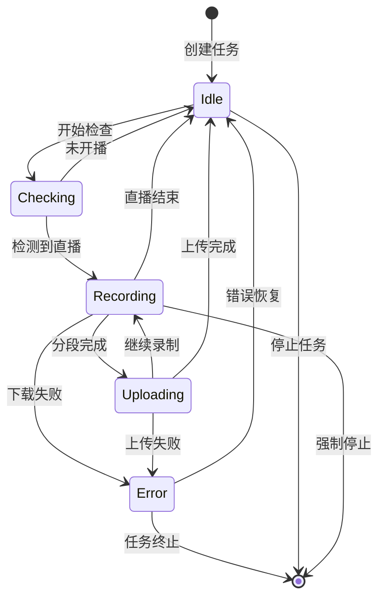
```mermaid
stateDiagram-v2
    [*] --> Idle: 创建任务
    
    Idle --> Checking: 开始检查
    Checking --> Idle: 未开播
    Checking --> Recording: 检测到直播
    
    Recording --> Uploading: 分段完成
    Uploading --> Recording: 继续录制
    
    Recording --> Idle: 直播结束
    Recording --> Error: 下载失败
    
    Uploading --> Idle: 上传完成
    Uploading --> Error: 上传失败
    
    Error --> Idle: 错误恢复
    Error --> [*]: 任务终止
    
    Idle --> [*]: 停止任务
    Recording --> [*]: 强制停止
```

### 状态更新流程

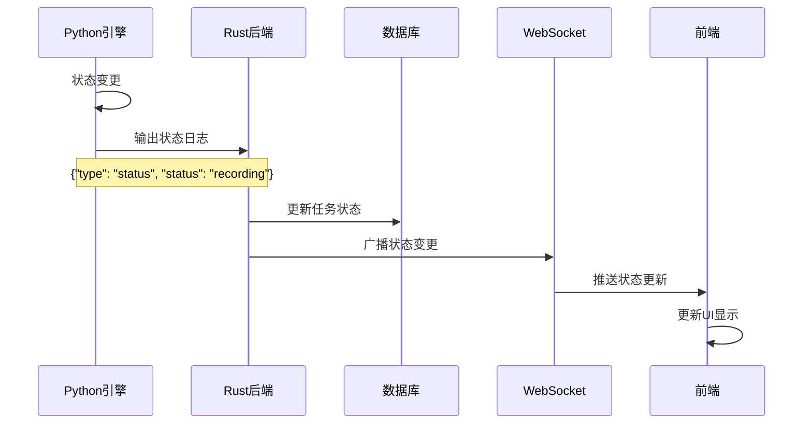
```mermaid
sequenceDiagram
    participant P as Python引擎
    participant B as Rust后端
    participant D as 数据库
    participant W as WebSocket
    participant F as 前端
    
    P->>P: 状态变更
    P->>B: 输出状态日志
    Note over P,B: {"type": "status", "status": "recording"}
    
    B->>D: 更新任务状态
    B->>W: 广播状态变更
    W->>F: 推送状态更新
    F->>F: 更新UI显示
```

## 日志传递机制

日志从 Python 引擎传递到前端，经过多个层次的处理。

### 日志流转图

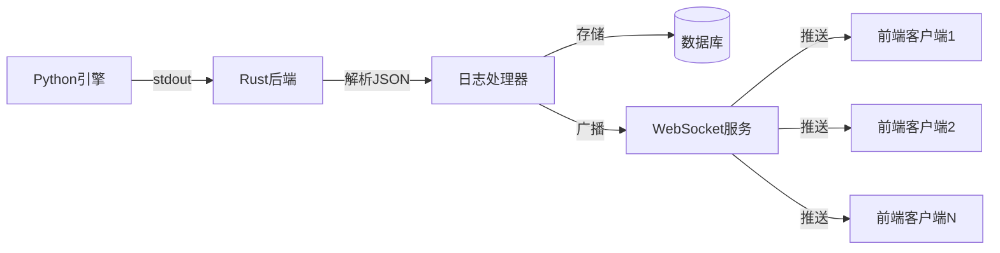
```mermaid
flowchart LR
    P[Python引擎] -->|stdout| R[Rust后端]
    R -->|解析JSON| L[日志处理器]
    L -->|存储| D[(数据库)]
    L -->|广播| W[WebSocket服务]
    W -->|推送| F1[前端客户端1]
    W -->|推送| F2[前端客户端2]
    W -->|推送| F3[前端客户端N]
```

### 日志处理流程

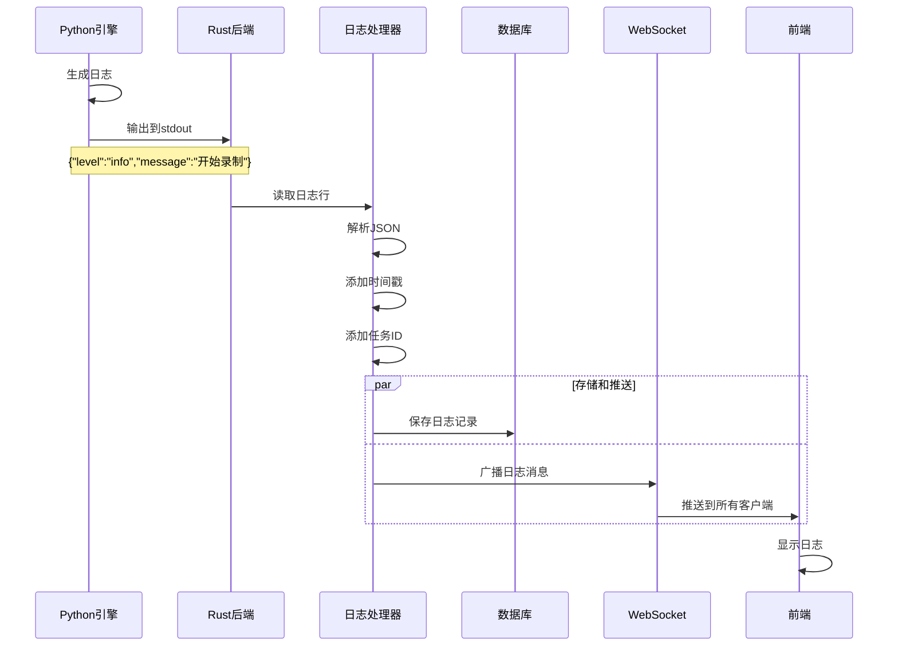
```mermaid
sequenceDiagram
    participant P as Python引擎
    participant R as Rust后端
    participant H as 日志处理器
    participant D as 数据库
    participant W as WebSocket
    participant F as 前端
    
    P->>P: 生成日志
    P->>R: 输出到stdout
    Note over P,R: {"level":"info","message":"开始录制"}
    
    R->>H: 读取日志行
    H->>H: 解析JSON
    H->>H: 添加时间戳
    H->>H: 添加任务ID
    
    par 存储和推送
        H->>D: 保存日志记录
        and
        H->>W: 广播日志消息
        W->>F: 推送到所有客户端
    end
    
    F->>F: 显示日志
```

## 事件传递机制

系统使用事件驱动架构处理各种异步事件。

### 事件流程

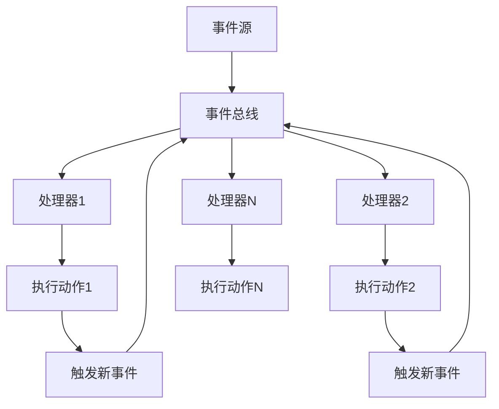
```mermaid
flowchart TD
    E[事件源] --> EB[事件总线]
    EB --> H1[处理器1]
    EB --> H2[处理器2]
    EB --> H3[处理器N]
    
    H1 --> A1[执行动作1]
    H2 --> A2[执行动作2]
    H3 --> A3[执行动作N]
    
    A1 --> NE1[触发新事件]
    A2 --> NE2[触发新事件]
    
    NE1 --> EB
    NE2 --> EB
```

### 事件类型和处理

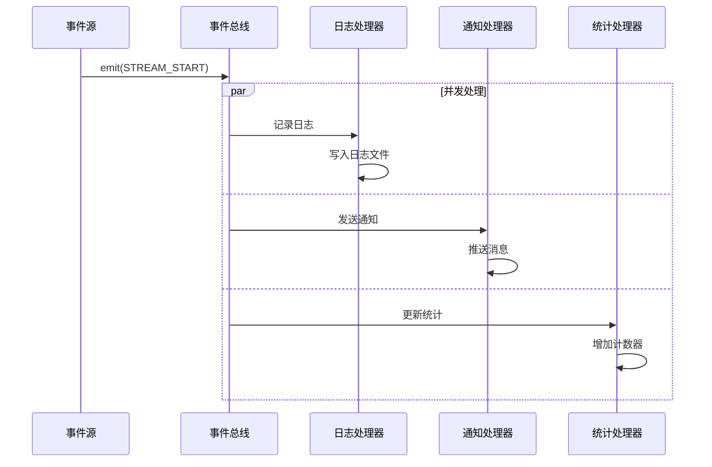
```mermaid
sequenceDiagram
    participant S as 事件源
    participant EB as 事件总线
    participant H1 as 日志处理器
    participant H2 as 通知处理器
    participant H3 as 统计处理器
    
    S->>EB: emit(STREAM_START)
    
    par 并发处理
        EB->>H1: 记录日志
        H1->>H1: 写入日志文件
        and
        EB->>H2: 发送通知
        H2->>H2: 推送消息
        and
        EB->>H3: 更新统计
        H3->>H3: 增加计数器
    end
```

## 数据持久化

系统中的各类数据需要持久化存储。

### 数据库表关系

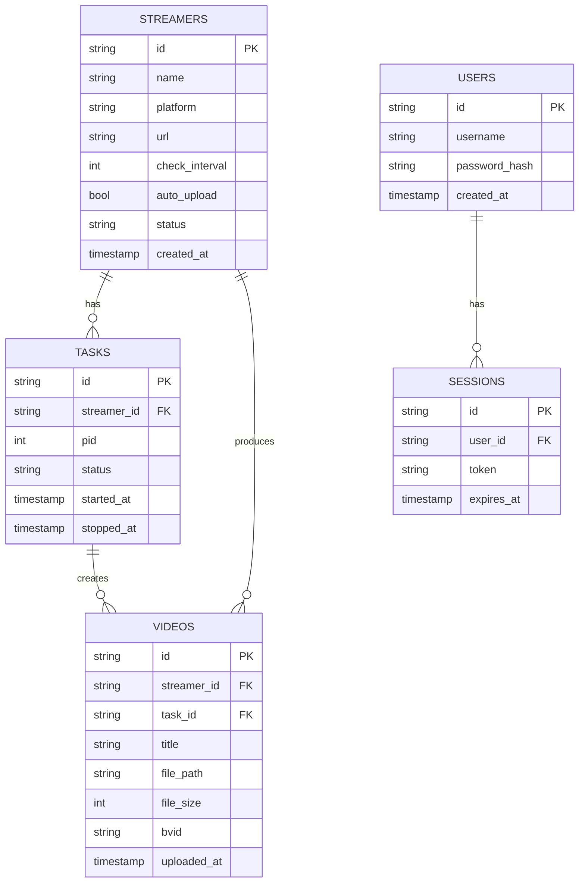
```mermaid
erDiagram
    STREAMERS ||--o{ TASKS : has
    STREAMERS ||--o{ VIDEOS : produces
    TASKS ||--o{ VIDEOS : creates
    USERS ||--o{ SESSIONS : has
    
    STREAMERS {
        string id PK
        string name
        string platform
        string url
        int check_interval
        bool auto_upload
        string status
        timestamp created_at
    }
    
    TASKS {
        string id PK
        string streamer_id FK
        int pid
        string status
        timestamp started_at
        timestamp stopped_at
    }
    
    VIDEOS {
        string id PK
        string streamer_id FK
        string task_id FK
        string title
        string file_path
        int file_size
        string bvid
        timestamp uploaded_at
    }
    
    USERS {
        string id PK
        string username
        string password_hash
        timestamp created_at
    }
    
    SESSIONS {
        string id PK
        string user_id FK
        string token
        timestamp expires_at
    }
```

### 数据写入流程

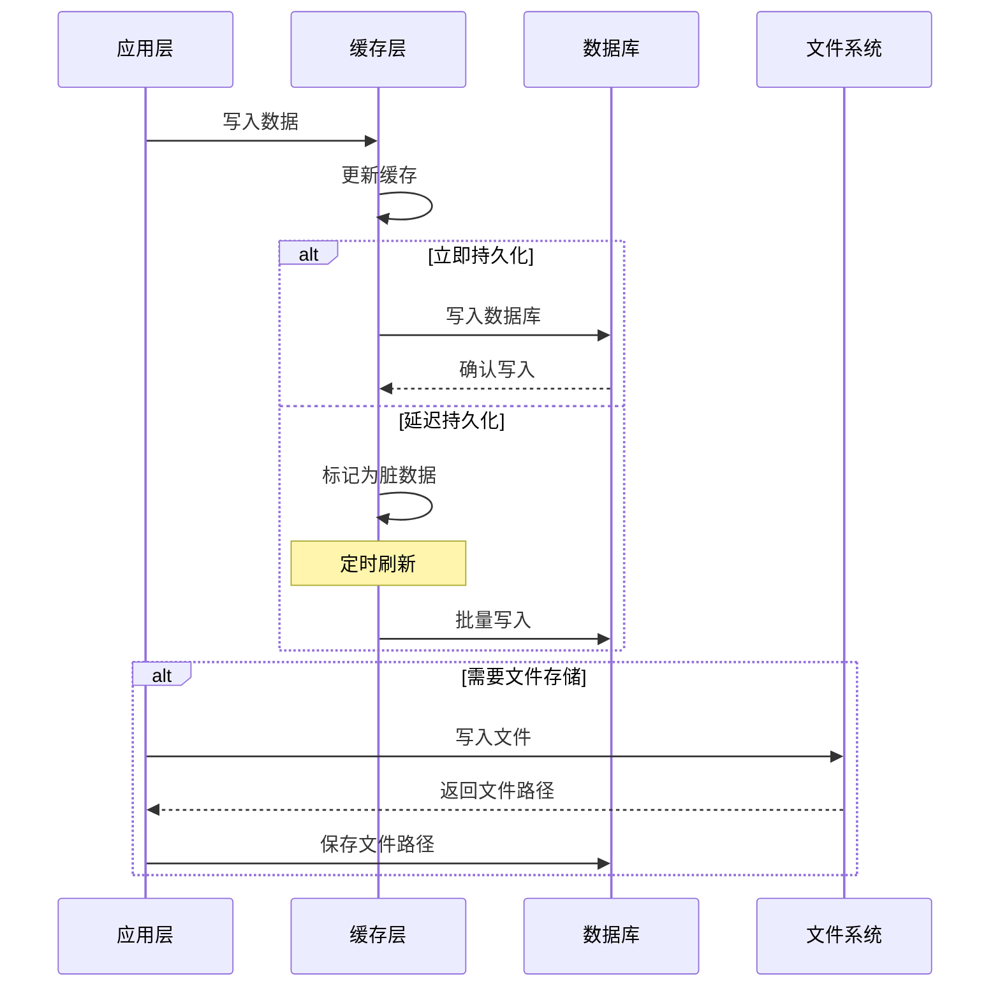
```mermaid
sequenceDiagram
    participant A as 应用层
    participant C as 缓存层
    participant D as 数据库
    participant F as 文件系统
    
    A->>C: 写入数据
    C->>C: 更新缓存
    
    alt 立即持久化
        C->>D: 写入数据库
        D-->>C: 确认写入
    else 延迟持久化
        C->>C: 标记为脏数据
        Note over C: 定时刷新
        C->>D: 批量写入
    end
    
    alt 需要文件存储
        A->>F: 写入文件
        F-->>A: 返回文件路径
        A->>D: 保存文件路径
    end
```

## WebSocket 实时通信

WebSocket 用于实时推送日志和状态更新。

### WebSocket 连接流程

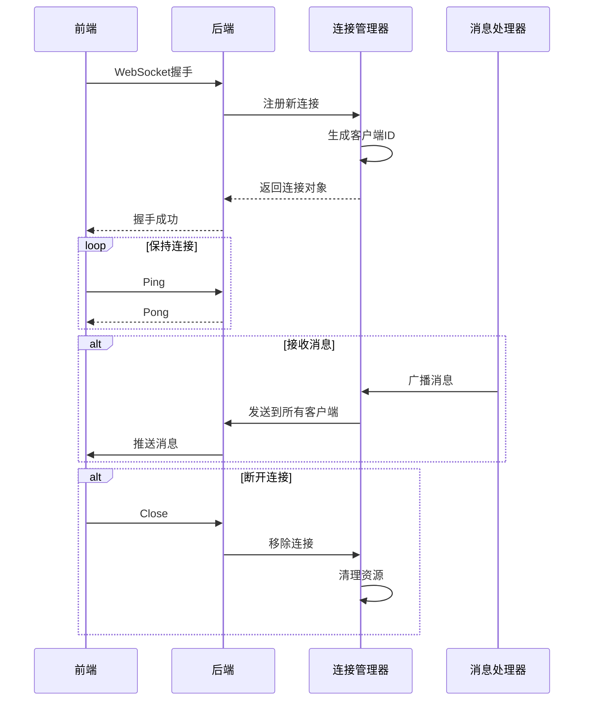
```mermaid
sequenceDiagram
    participant F as 前端
    participant B as 后端
    participant M as 连接管理器
    participant H as 消息处理器
    
    F->>B: WebSocket握手
    B->>M: 注册新连接
    M->>M: 生成客户端ID
    M-->>B: 返回连接对象
    B-->>F: 握手成功
    
    loop 保持连接
        F->>B: Ping
        B-->>F: Pong
    end
    
    alt 接收消息
        H->>M: 广播消息
        M->>B: 发送到所有客户端
        B->>F: 推送消息
    end
    
    alt 断开连接
        F->>B: Close
        B->>M: 移除连接
        M->>M: 清理资源
    end
```

### 消息广播机制

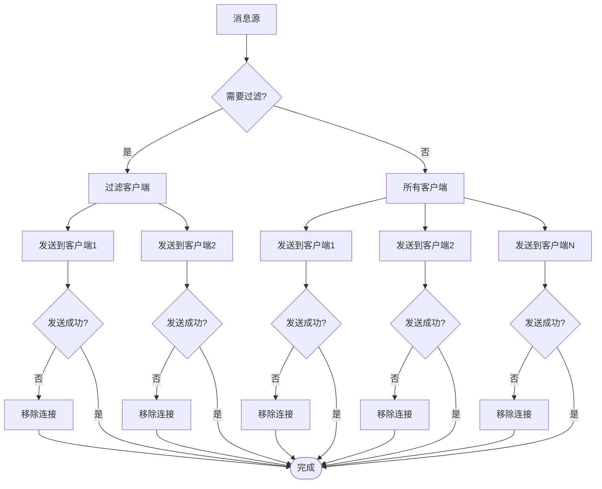
```mermaid
flowchart TD
    Start[消息源] --> Filter{需要过滤?}
    
    Filter -->|是| FilterClients[过滤客户端]
    Filter -->|否| AllClients[所有客户端]
    
    FilterClients --> Send1[发送到客户端1]
    FilterClients --> Send2[发送到客户端2]
    
    AllClients --> SendAll1[发送到客户端1]
    AllClients --> SendAll2[发送到客户端2]
    AllClients --> SendAll3[发送到客户端N]
    
    Send1 --> Check1{发送成功?}
    Send2 --> Check2{发送成功?}
    SendAll1 --> CheckAll1{发送成功?}
    SendAll2 --> CheckAll2{发送成功?}
    SendAll3 --> CheckAll3{发送成功?}
    
    Check1 -->|否| Remove1[移除连接]
    Check2 -->|否| Remove2[移除连接]
    CheckAll1 -->|否| RemoveAll1[移除连接]
    CheckAll2 -->|否| RemoveAll2[移除连接]
    CheckAll3 -->|否| RemoveAll3[移除连接]
    
    Check1 -->|是| End([完成])
    Check2 -->|是| End
    CheckAll1 -->|是| End
    CheckAll2 -->|是| End
    CheckAll3 -->|是| End
    Remove1 --> End
    Remove2 --> End
    RemoveAll1 --> End
    RemoveAll2 --> End
    RemoveAll3 --> End
```

## 配置同步流程

配置文件的读取和更新流程。

### 配置读取流程

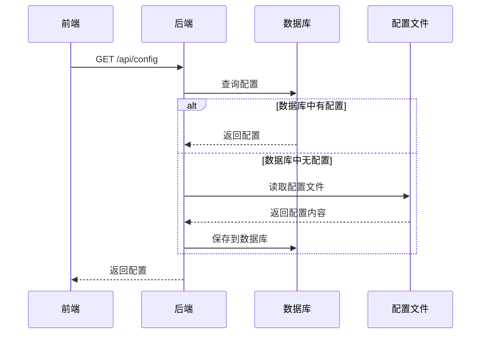
```mermaid
sequenceDiagram
    participant F as 前端
    participant B as 后端
    participant D as 数据库
    participant C as 配置文件
    
    F->>B: GET /api/config
    B->>D: 查询配置
    
    alt 数据库中有配置
        D-->>B: 返回配置
    else 数据库中无配置
        B->>C: 读取配置文件
        C-->>B: 返回配置内容
        B->>D: 保存到数据库
    end
    
    B-->>F: 返回配置
```

### 配置更新流程

```mermaid
sequenceDiagram
    participant F as 前端
    participant B as 后端
    participant D as 数据库
    participant C as 配置文件
    participant P as Python引擎
    
    F->>B: PUT /api/config
    B->>B: 验证配置
    
    alt 验证通过
        B->>D: 更新数据库
        B->>C: 写入配置文件
        B->>P: 发送重载信号
        P->>C: 重新加载配置
        P-->>B: 重载完成
        B-->>F: 返回成功
    else 验证失败
        B-->>F: 返回错误
    end
```

## 错误处理流程

系统中的错误处理和恢复机制。

### 错误处理流程图

```mermaid
flowchart TD
    Start[操作开始] --> Try{执行操作}
    
    Try -->|成功| Success[返回结果]
    Try -->|失败| CatchError[捕获错误]
    
    CatchError --> LogError[记录错误日志]
    LogError --> CheckRetry{可重试?}
    
    CheckRetry -->|是| CheckCount{重试次数<最大值?}
    CheckCount -->|是| Wait[等待退避时间]
    Wait --> Try
    CheckCount -->|否| NotifyUser[通知用户]
    
    CheckRetry -->|否| NotifyUser
    NotifyUser --> Cleanup[清理资源]
    Cleanup --> ReturnError[返回错误]
    
    Success --> End([结束])
    ReturnError --> End
```

### 错误恢复策略

```mermaid
sequenceDiagram
    participant S as 系统
    participant E as 错误处理器
    participant L as 日志系统
    participant N as 通知系统
    participant R as 恢复机制
    
    S->>E: 抛出错误
    E->>L: 记录错误详情
    E->>E: 分析错误类型
    
    alt 网络错误
        E->>R: 触发重连机制
        R->>R: 指数退避重试
        R-->>S: 恢复连接
    else 文件系统错误
        E->>R: 清理临时文件
        R->>R: 重新创建目录
        R-->>S: 恢复操作
    else 严重错误
        E->>N: 发送告警通知
        E->>S: 停止任务
        E->>R: 保存现场数据
    end
```

## 性能监控数据流

系统性能指标的收集和展示。

### 监控数据流程

```mermaid
flowchart LR
    P1[Python引擎] -->|性能指标| C[收集器]
    P2[Rust后端] -->|性能指标| C
    P3[数据库] -->|性能指标| C
    
    C --> A[聚合器]
    A --> S[存储]
    
    S --> Q[查询接口]
    Q --> D[Dashboard]
    Q --> API[API接口]
    
    D --> U[用户界面]
    API --> M[监控系统]
```

### 指标收集时序

```mermaid
sequenceDiagram
    participant W as 工作进程
    participant C as 指标收集器
    participant A as 聚合器
    participant S as 存储
    participant D as Dashboard
    
    loop 每秒
        W->>C: 报告指标
        Note over W,C: CPU, 内存, 网络
    end
    
    loop 每分钟
        C->>A: 发送原始数据
        A->>A: 计算统计值
        A->>S: 存储聚合数据
    end
    
    loop 实时查询
        D->>S: 查询最新数据
        S-->>D: 返回指标
        D->>D: 更新图表
    end
```

## 数据流优化

### 缓存策略

```mermaid
flowchart TD
    Request[请求数据] --> CheckCache{缓存存在?}
    
    CheckCache -->|是| CheckExpire{缓存过期?}
    CheckExpire -->|否| ReturnCache[返回缓存]
    CheckExpire -->|是| FetchData[获取新数据]
    
    CheckCache -->|否| FetchData
    FetchData --> UpdateCache[更新缓存]
    UpdateCache --> ReturnData[返回数据]
    
    ReturnCache --> End([结束])
    ReturnData --> End
```

### 批量处理

```mermaid
sequenceDiagram
    participant A as 应用
    participant B as 批处理器
    participant D as 数据库
    
    loop 接收请求
        A->>B: 添加操作
        B->>B: 加入队列
    end
    
    alt 队列满或超时
        B->>B: 合并操作
        B->>D: 批量执行
        D-->>B: 返回结果
        B-->>A: 分发结果
    end
```

## 总结

biliup 的数据流设计遵循以下原则：

1. **异步优先**: 所有 I/O 操作都使用异步模式，提高并发性能
2. **事件驱动**: 使用事件总线解耦组件，提高系统灵活性
3. **流式处理**: 边录边传，减少磁盘占用和延迟
4. **错误恢复**: 完善的错误处理和重试机制，提高系统可靠性
5. **实时反馈**: 通过 WebSocket 实时推送状态和日志，提升用户体验

## 相关链接

- [架构概览](./overview.md) - 了解整体架构设计
- [前端架构](./frontend.md) - 了解前端数据处理
- [后端架构](./backend.md) - 了解后端数据处理
- [Python 引擎](./python-engine.md) - 了解引擎层数据处理
