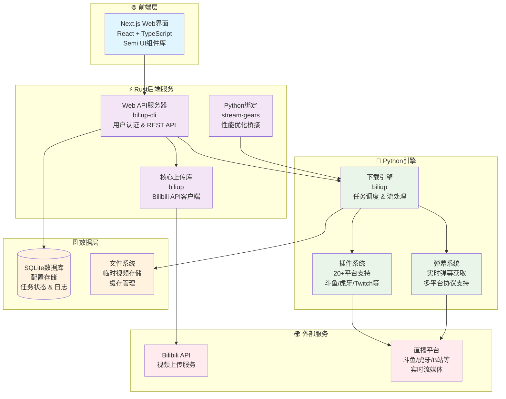
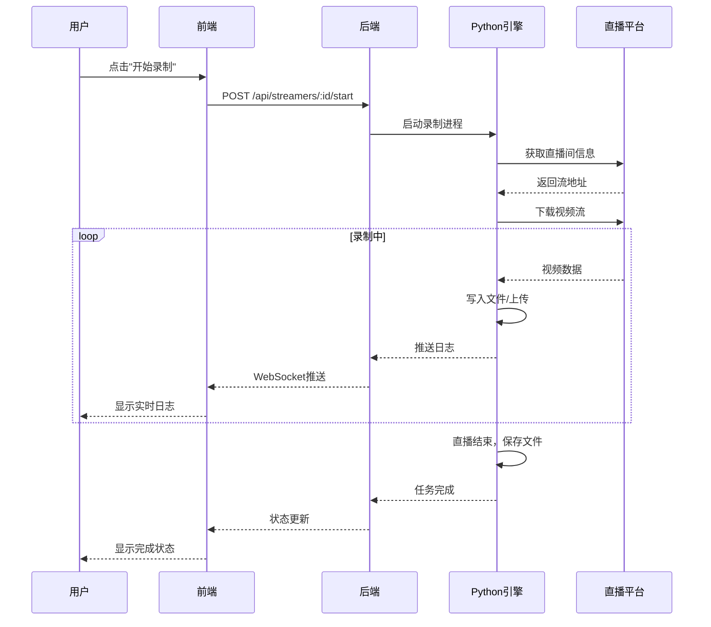
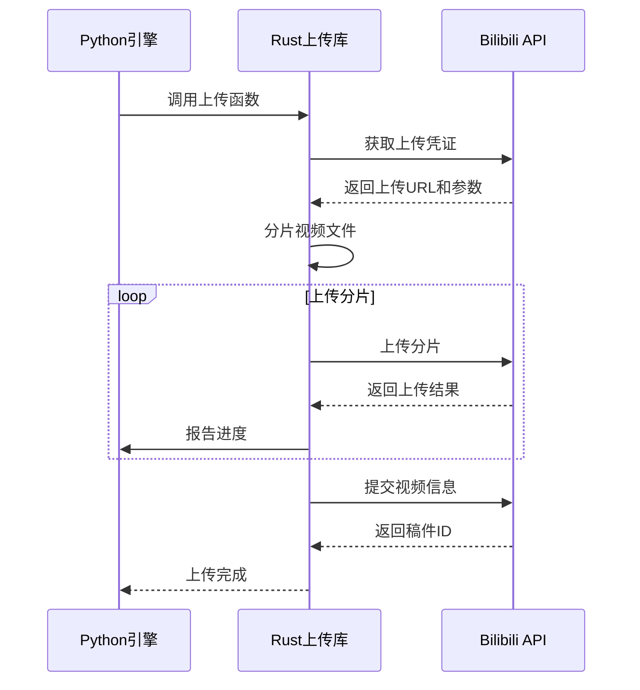

+++
title = "架构概览"
description = "了解 biliup 的整体架构设计和各层组件的职责划分"
date = 2025-01-10T00:00:00+00:00
updated = 2025-01-10T00:00:00+00:00
draft = false
weight = 10
template = "docs/page.html"

[extra]
lead = "biliup 采用 Rust 后端 + Python 引擎 + Next.js 前端的混合架构，充分发挥各语言的优势，实现高性能、易扩展的直播录制和上传系统。"
toc = true
top = false
+++

## 整体架构

biliup 采用三层架构设计，将系统划分为前端层、后端层和引擎层，各层职责清晰，通过标准接口进行通信。



## 三层架构详解

### 前端层

**职责**: 提供用户交互界面，展示系统状态和任务信息

**技术栈**:
- **Next.js 14**: React 框架，支持服务端渲染和静态生成
- **React 18**: 用户界面库
- **TypeScript**: 类型安全的 JavaScript 超集
- **Semi UI**: 字节跳动开源的 React 组件库

**核心功能**:
- 任务管理界面（创建、启动、停止、删除任务）
- 实时日志查看（通过 WebSocket 接收日志推送）
- 配置管理界面（编辑主播配置和上传参数）
- 视频列表和历史记录查看
- 用户认证和权限管理

**通信方式**:
- 通过 HTTP REST API 与后端通信
- 通过 WebSocket 接收实时日志和状态更新

### 后端层

**职责**: 提供 Web API 服务，管理任务调度，处理上传逻辑

**技术栈**:
- **Rust**: 系统编程语言，高性能、内存安全
- **Axum**: 现代化的 Web 框架
- **SQLite**: 轻量级嵌入式数据库
- **Tower**: 异步服务抽象层
- **Tokio**: 异步运行时

**核心组件**:

#### biliup-cli
Web API 服务器，提供 REST API 和 WebSocket 服务：
- 用户认证和会话管理
- 任务 CRUD 操作
- 配置文件读写
- 实时日志推送
- 静态文件服务（前端资源）

#### biliup
核心上传库，封装 Bilibili API 客户端：
- 视频上传（支持多种上传线路）
- 分片上传和断点续传
- 视频元信息管理
- 封面上传
- 稿件管理（追加视频、修改信息）

#### stream-gears
Python 绑定库，使用 PyO3 实现 Rust 和 Python 的互操作：
- 暴露 Rust 上传功能给 Python
- 性能优化的桥接层
- 异步任务调度

**数据存储**:
- **SQLite 数据库**: 存储主播配置、任务状态、上传历史
- **文件系统**: 存储 Cookie、日志文件、临时视频文件

### 引擎层

**职责**: 执行实际的下载和上传任务，管理插件系统

**技术栈**:
- **Python 3.9+**: 动态语言，丰富的生态系统
- **asyncio**: 异步 I/O 框架
- **aiohttp**: 异步 HTTP 客户端
- **ffmpeg**: 视频处理工具（外部依赖）

**核心组件**:

#### 下载引擎
负责从直播平台下载视频流：
- 支持 HTTP-FLV、HLS、RTMP 等多种协议
- 自动重连和错误恢复
- 分段录制（按时间或文件大小）
- 边录边传（不落盘直接上传）

#### 插件系统
支持 20+ 直播平台的下载插件：
- 基于装饰器的插件注册机制
- 统一的插件接口
- 平台特定的认证和 Cookie 处理
- 自动发现和加载插件

#### 弹幕系统
实时获取和保存弹幕：
- 支持多平台弹幕协议
- 弹幕转换为 XML 格式
- 与视频录制同步

#### 任务调度
管理多个录制任务的并发执行：
- 定时检查直播状态
- 自动启动和停止录制
- 任务队列管理
- 资源限制和并发控制

## 组件通信方式

### 前端 ↔ 后端

**HTTP REST API**:
```
GET  /api/streamers          # 获取主播列表
POST /api/streamers          # 创建主播配置
PUT  /api/streamers/:id      # 更新主播配置
DELETE /api/streamers/:id    # 删除主播配置
POST /api/streamers/:id/start   # 启动录制任务
POST /api/streamers/:id/stop    # 停止录制任务
```

**WebSocket**:
```
ws://host:port/api/ws        # 实时日志和状态推送
```

消息格式：
```json
{
  "type": "log",
  "streamer_id": "123",
  "level": "info",
  "message": "开始录制...",
  "timestamp": "2025-01-10T12:00:00Z"
}
```

### 后端 ↔ 引擎

**进程间通信**:
- 后端通过 `subprocess` 启动 Python 进程
- 通过标准输入/输出传递命令和日志
- 通过文件系统共享配置和数据

**函数调用**:
- 通过 `stream-gears` 库直接调用 Rust 函数
- 使用 PyO3 实现零拷贝数据传递
- 异步任务调度

### 引擎 ↔ 外部服务

**直播平台**:
- HTTP/HTTPS 请求获取直播间信息
- WebSocket 连接获取实时弹幕
- 流媒体协议下载视频（HTTP-FLV、HLS、RTMP）

**Bilibili API**:
- HTTP API 上传视频分片
- 获取上传凭证和线路信息
- 提交视频元信息

## 数据流转

### 录制流程



### 上传流程



## 技术选型理由

### 为什么使用混合架构？

**Rust 后端**:
- **高性能**: 接近 C/C++ 的性能，适合处理高并发请求
- **内存安全**: 编译时保证内存安全，避免常见的内存错误
- **异步支持**: Tokio 提供高效的异步运行时
- **类型安全**: 强类型系统减少运行时错误

**Python 引擎**:
- **丰富的生态**: 大量的视频处理和网络库
- **快速开发**: 动态语言，适合快速迭代和插件开发
- **易于扩展**: 用户可以轻松添加新的平台支持
- **社区支持**: 大量的第三方库和工具

**Next.js 前端**:
- **现代化**: React 18 和 Next.js 14 提供最新的前端特性
- **开发体验**: 热重载、TypeScript 支持、组件化开发
- **性能优化**: 自动代码分割、图片优化、服务端渲染
- **生态系统**: 丰富的 React 组件库和工具链

### 各层的优势互补

| 层次 | 语言 | 优势 | 应用场景 |
|------|------|------|----------|
| 前端层 | TypeScript | 类型安全、组件化 | 用户界面、交互逻辑 |
| 后端层 | Rust | 高性能、内存安全 | API 服务、上传逻辑 |
| 引擎层 | Python | 易扩展、生态丰富 | 下载插件、任务调度 |

## 系统特点

### 高性能

- **Rust 后端**: 高效处理并发请求，低内存占用
- **异步 I/O**: 前后端都使用异步模型，提高吞吐量
- **零拷贝**: stream-gears 使用 PyO3 实现高效的数据传递
- **边录边传**: 不落盘直接上传，节省磁盘 I/O

### 易扩展

- **插件系统**: 基于装饰器的插件机制，轻松添加新平台
- **模块化设计**: 各层职责清晰，易于维护和扩展
- **配置驱动**: 通过配置文件控制行为，无需修改代码

### 高可用

- **自动重连**: 网络断开时自动重试
- **错误恢复**: 异常情况下保存已录制内容
- **任务队列**: 失败任务自动重试
- **日志记录**: 详细的日志便于问题排查

### 用户友好

- **Web 界面**: 直观的图形界面，无需命令行操作
- **实时反馈**: WebSocket 推送实时日志和状态
- **多平台支持**: 支持 Windows、Linux、macOS
- **Docker 部署**: 一键启动，无需配置环境

## 性能指标

### 并发能力

- **同时录制**: 支持 50+ 主播同时录制（取决于硬件）
- **API 吞吐**: 单实例支持 1000+ QPS
- **WebSocket 连接**: 支持 100+ 并发连接

### 资源占用

- **内存**: 基础占用约 50MB，每个录制任务额外 20-50MB
- **CPU**: 空闲时 < 1%，录制时取决于视频码率和数量
- **磁盘**: 边录边传模式下几乎不占用磁盘空间

### 上传速度

- **多线程上传**: 支持 3-10 个并发分片上传
- **多线路**: 自动选择最快的上传线路
- **断点续传**: 网络中断后自动恢复上传

## 相关链接

- [前端架构](./frontend.md) - 详细了解前端实现
- [后端架构](./backend.md) - 深入了解 Rust 后端
- [Python 引擎](./python-engine.md) - 探索 Python 引擎设计
- [数据流设计](./data-flow.md) - 了解完整的数据流转
- [设计决策](./design-decisions.md) - 了解技术选型的权衡
