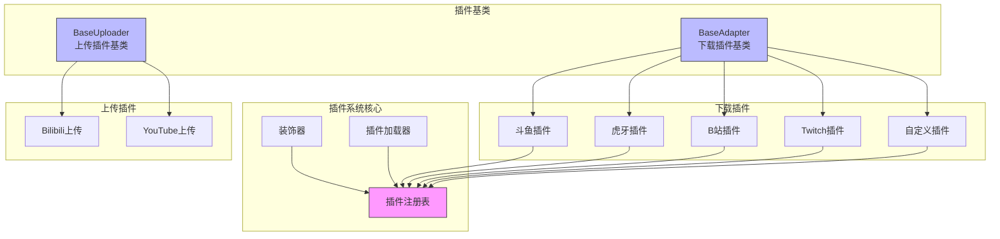
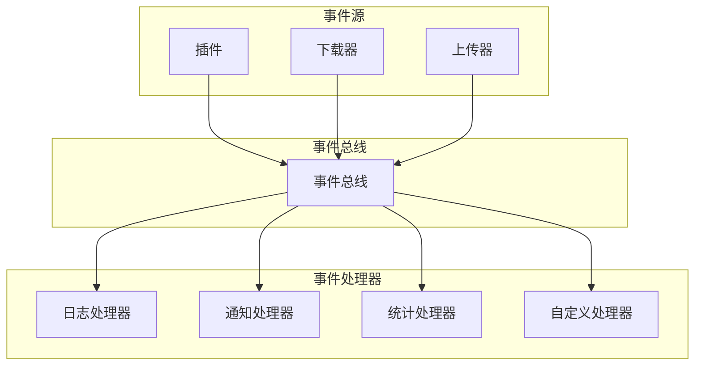
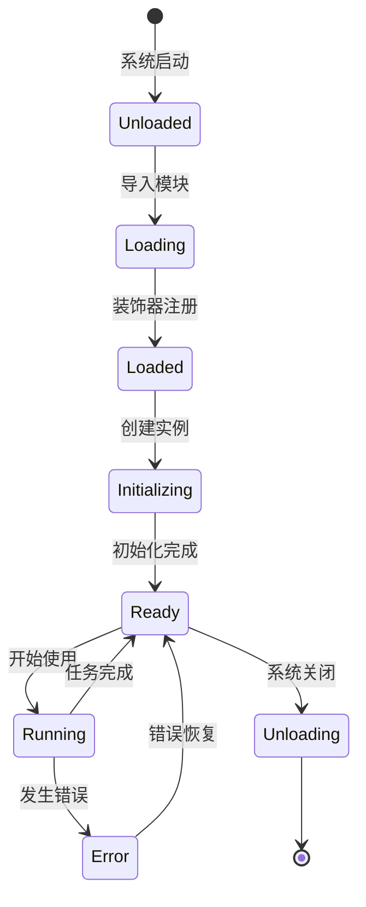

+++
title = "插件系统"
description = "深入了解 biliup 的插件系统设计和实现原理"
date = 2025-01-10T00:00:00+00:00
updated = 2025-01-10T00:00:00+00:00
draft = false
weight = 60
template = "docs/page.html"

[extra]
lead = "biliup 的插件系统是其核心特性之一，通过装饰器模式和事件驱动框架，轻松支持 20+ 直播平台的录制和上传。"
toc = true
top = false
+++

## 概述

插件系统使 biliup 能够支持多个直播平台，而无需修改核心代码。每个平台都是一个独立的插件，实现统一的接口。

### 设计目标

- **易扩展**: 添加新平台只需实现插件接口
- **松耦合**: 插件之间互不依赖，独立开发和测试
- **自动发现**: 通过装饰器自动注册插件
- **统一接口**: 所有插件实现相同的接口规范
- **热插拔**: 支持动态加载和卸载插件

### 插件类型

biliup 支持两类插件：

1. **下载插件**: 从直播平台下载视频流
2. **上传插件**: 将视频上传到不同平台（目前主要是 Bilibili）

## 插件架构

### 整体架构图



## 下载插件系统

### 插件基类

所有下载插件都继承自 `BaseAdapter` 基类：

```python
# plugins/base_adapter.py
from abc import ABC, abstractmethod
from typing import Optional, Dict, Tuple
import aiohttp

class BaseAdapter(ABC):
    """下载插件基类
    
    所有平台插件都必须继承此类并实现抽象方法
    """
    
    def __init__(self):
        self.name = self.__class__.__name__
        self.headers = {
            'User-Agent': 'Mozilla/5.0 (Windows NT 10.0; Win64; x64) '
                         'AppleWebKit/537.36 (KHTML, like Gecko) '
                         'Chrome/91.0.4472.124 Safari/537.36'
        }
        self.cookies = {}
    
    @abstractmethod
    async def get_live_status(self, url: str) -> Tuple[bool, Optional[str]]:
        """检查直播状态
        
        Args:
            url: 直播间URL
            
        Returns:
            (is_live, stream_url): 
                - is_live: 是否正在直播
                - stream_url: 流地址（如果正在直播）
        """
        pass
    
    @abstractmethod
    async def get_room_info(self, url: str) -> Dict:
        """获取直播间信息
        
        Args:
            url: 直播间URL
            
        Returns:
            {
                'title': 直播标题,
                'streamer': 主播名称,
                'cover': 封面图片URL,
                'description': 直播简介,
            }
        """
        pass
    
    def parse_url(self, url: str) -> str:
        """解析URL，提取房间号
        
        Args:
            url: 直播间URL
            
        Returns:
            room_id: 房间号
        """
        return url
    
    async def get_danmaku_client(self, room_id: str):
        """获取弹幕客户端（可选实现）
        
        Args:
            room_id: 房间号
            
        Returns:
            弹幕客户端实例，如果不支持则返回 None
        """
        return None
    
    async def _request(self, url: str, method: str = 'GET', **kwargs) -> aiohttp.ClientResponse:
        """发送HTTP请求的辅助方法
        
        Args:
            url: 请求URL
            method: HTTP方法
            **kwargs: 其他请求参数
            
        Returns:
            响应对象
        """
        async with aiohttp.ClientSession() as session:
            async with session.request(
                method, 
                url, 
                headers=self.headers,
                cookies=self.cookies,
                **kwargs
            ) as response:
                return response
```

### 装饰器注册机制

使用装饰器自动注册插件：

```python
# engine/decorators.py
from typing import Dict, Type, Optional
from .plugins.base_adapter import BaseAdapter

# 全局插件注册表
_plugin_registry: Dict[str, Type[BaseAdapter]] = {}

def plugin(name: str, *, priority: int = 0):
    """插件注册装饰器
    
    Args:
        name: 插件名称（平台标识）
        priority: 优先级，数字越大优先级越高
        
    Example:
        @plugin('douyu', priority=10)
        class DouyuAdapter(BaseAdapter):
            pass
    """
    def decorator(cls: Type[BaseAdapter]):
        if not issubclass(cls, BaseAdapter):
            raise TypeError(f"{cls.__name__} must inherit from BaseAdapter")
        
        _plugin_registry[name] = {
            'class': cls,
            'priority': priority,
            'name': name,
        }
        return cls
    return decorator

def get_plugin(name: str) -> BaseAdapter:
    """获取插件实例
    
    Args:
        name: 插件名称
        
    Returns:
        插件实例
        
    Raises:
        ValueError: 如果插件不存在
    """
    if name not in _plugin_registry:
        raise ValueError(f"Plugin '{name}' not found. Available: {list_plugins()}")
    
    plugin_info = _plugin_registry[name]
    return plugin_info['class']()

def list_plugins() -> list[str]:
    """列出所有已注册的插件
    
    Returns:
        插件名称列表
    """
    return sorted(_plugin_registry.keys())

def get_plugin_info(name: str) -> dict:
    """获取插件信息
    
    Args:
        name: 插件名称
        
    Returns:
        插件信息字典
    """
    if name not in _plugin_registry:
        raise ValueError(f"Plugin '{name}' not found")
    return _plugin_registry[name]
```

### 插件实现示例

#### 斗鱼插件

```python
# plugins/douyu.py
import re
import json
import aiohttp
from .base_adapter import BaseAdapter
from ..engine.decorators import plugin

@plugin('douyu', priority=10)
class DouyuAdapter(BaseAdapter):
    """斗鱼直播插件
    
    支持功能：
    - 检查直播状态
    - 获取流地址（HTTP-FLV）
    - 获取房间信息
    - 弹幕获取
    """
    
    API_URL = "https://www.douyu.com/betard/{room_id}"
    STREAM_API = "https://www.douyu.com/lapi/live/getH5Play/{room_id}"
    
    async def get_live_status(self, url: str) -> tuple[bool, str]:
        """检查斗鱼直播状态"""
        room_id = self.parse_url(url)
        
        async with aiohttp.ClientSession() as session:
            async with session.get(
                self.API_URL.format(room_id=room_id),
                headers=self.headers
            ) as response:
                data = await response.json()
                
                if 'room' not in data:
                    return False, None
                
                room_info = data['room']
                is_live = room_info.get('show_status') == 1
                
                if is_live:
                    stream_url = await self._get_stream_url(room_id)
                    return True, stream_url
                
                return False, None
    
    async def get_room_info(self, url: str) -> dict:
        """获取斗鱼房间信息"""
        room_id = self.parse_url(url)
        
        async with aiohttp.ClientSession() as session:
            async with session.get(
                self.API_URL.format(room_id=room_id),
                headers=self.headers
            ) as response:
                data = await response.json()
                room_info = data.get('room', {})
                
                return {
                    'title': room_info.get('room_name', ''),
                    'streamer': room_info.get('owner_name', ''),
                    'cover': room_info.get('room_pic', ''),
                    'description': room_info.get('room_intro', ''),
                }
    
    def parse_url(self, url: str) -> str:
        """从URL提取房间号
        
        支持格式：
        - https://www.douyu.com/123456
        - douyu.com/123456
        - 123456
        """
        match = re.search(r'douyu\.com/(\d+)', url)
        if match:
            return match.group(1)
        
        # 如果是纯数字，直接返回
        if url.isdigit():
            return url
        
        raise ValueError(f"Invalid Douyu URL: {url}")
    
    async def _get_stream_url(self, room_id: str) -> str:
        """获取真实流地址
        
        斗鱼的流地址需要通过特定API获取，并且包含签名验证
        """
        async with aiohttp.ClientSession() as session:
            async with session.post(
                self.STREAM_API.format(room_id=room_id),
                headers=self.headers,
                data={'rid': room_id, 'rate': 0}  # rate=0 表示原画
            ) as response:
                data = await response.json()
                
                if data.get('error') == 0:
                    rtmp_url = data['data']['rtmp_url']
                    rtmp_live = data['data']['rtmp_live']
                    return f"{rtmp_url}/{rtmp_live}"
                
                raise Exception(f"Failed to get stream URL: {data.get('msg')}")
    
    async def get_danmaku_client(self, room_id: str):
        """获取弹幕客户端"""
        from ..danmaku.douyu import DouyuDanmaku
        return DouyuDanmaku(room_id)
```

#### 虎牙插件

```python
# plugins/huya.py
import re
import base64
import aiohttp
from .base_adapter import BaseAdapter
from ..engine.decorators import plugin

@plugin('huya', priority=10)
class HuyaAdapter(BaseAdapter):
    """虎牙直播插件"""
    
    async def get_live_status(self, url: str) -> tuple[bool, str]:
        """检查虎牙直播状态"""
        room_id = self.parse_url(url)
        
        async with aiohttp.ClientSession() as session:
            async with session.get(url, headers=self.headers) as response:
                html = await response.text()
                
                # 从HTML中提取直播状态
                is_live = '"isOn":true' in html or '"liveStatus":"ON"' in html
                
                if is_live:
                    stream_url = self._extract_stream_url(html)
                    return True, stream_url
                
                return False, None
    
    async def get_room_info(self, url: str) -> dict:
        """获取虎牙房间信息"""
        async with aiohttp.ClientSession() as session:
            async with session.get(url, headers=self.headers) as response:
                html = await response.text()
                
                # 使用正则表达式提取信息
                title_match = re.search(r'"introduction":"([^"]+)"', html)
                streamer_match = re.search(r'"nick":"([^"]+)"', html)
                cover_match = re.search(r'"avatar":"([^"]+)"', html)
                
                return {
                    'title': title_match.group(1) if title_match else '',
                    'streamer': streamer_match.group(1) if streamer_match else '',
                    'cover': cover_match.group(1) if cover_match else '',
                    'description': '',
                }
    
    def parse_url(self, url: str) -> str:
        """从URL提取房间号"""
        match = re.search(r'huya\.com/(\w+)', url)
        if match:
            return match.group(1)
        return url
    
    def _extract_stream_url(self, html: str) -> str:
        """从HTML中提取流地址
        
        虎牙的流地址在页面的JavaScript变量中
        """
        # 提取 stream 对象
        match = re.search(r'"stream":\s*({[^}]+})', html)
        if not match:
            raise Exception("Failed to extract stream info")
        
        stream_info = match.group(1)
        
        # 提取 flv 地址
        flv_match = re.search(r'"flv":\s*{[^}]*"url":"([^"]+)"', stream_info)
        if flv_match:
            url = flv_match.group(1)
            # URL可能是base64编码的
            try:
                url = base64.b64decode(url).decode('utf-8')
            except:
                pass
            return url.replace('\\/', '/')
        
        raise Exception("Failed to extract stream URL")
```

#### Twitch 插件

```python
# plugins/twitch.py
import re
import aiohttp
from .base_adapter import BaseAdapter
from ..engine.decorators import plugin

@plugin('twitch', priority=10)
class TwitchAdapter(BaseAdapter):
    """Twitch 直播插件"""
    
    API_URL = "https://api.twitch.tv/helix/streams"
    CLIENT_ID = "your_client_id"  # 需要配置
    
    def __init__(self):
        super().__init__()
        self.headers.update({
            'Client-ID': self.CLIENT_ID,
        })
    
    async def get_live_status(self, url: str) -> tuple[bool, str]:
        """检查 Twitch 直播状态"""
        channel = self.parse_url(url)
        
        async with aiohttp.ClientSession() as session:
            async with session.get(
                self.API_URL,
                headers=self.headers,
                params={'user_login': channel}
            ) as response:
                data = await response.json()
                
                if data['data']:
                    # 使用 streamlink 获取流地址
                    stream_url = await self._get_stream_url(channel)
                    return True, stream_url
                
                return False, None
    
    async def get_room_info(self, url: str) -> dict:
        """获取 Twitch 频道信息"""
        channel = self.parse_url(url)
        
        async with aiohttp.ClientSession() as session:
            async with session.get(
                f"https://api.twitch.tv/helix/users",
                headers=self.headers,
                params={'login': channel}
            ) as response:
                data = await response.json()
                
                if data['data']:
                    user = data['data'][0]
                    return {
                        'title': user.get('display_name', ''),
                        'streamer': user.get('display_name', ''),
                        'cover': user.get('profile_image_url', ''),
                        'description': user.get('description', ''),
                    }
                
                return {}
    
    def parse_url(self, url: str) -> str:
        """从URL提取频道名"""
        match = re.search(r'twitch\.tv/(\w+)', url)
        if match:
            return match.group(1)
        return url
    
    async def _get_stream_url(self, channel: str) -> str:
        """使用 streamlink 获取流地址"""
        import subprocess
        result = subprocess.run(
            ['streamlink', '--stream-url', f'https://twitch.tv/{channel}', 'best'],
            capture_output=True,
            text=True
        )
        return result.stdout.strip()
```

### 开发自定义插件

开发新的平台插件非常简单，只需三步：

#### 1. 创建插件文件

在 `plugins/` 目录下创建新文件，例如 `my_platform.py`：

```python
# plugins/my_platform.py
from .base_adapter import BaseAdapter
from ..engine.decorators import plugin

@plugin('my_platform')
class MyPlatformAdapter(BaseAdapter):
    """我的平台插件"""
    
    async def get_live_status(self, url: str) -> tuple[bool, str]:
        # 实现检查直播状态的逻辑
        pass
    
    async def get_room_info(self, url: str) -> dict:
        # 实现获取房间信息的逻辑
        pass
```

#### 2. 实现必需方法

必须实现 `get_live_status` 和 `get_room_info` 两个方法。

#### 3. 注册插件

使用 `@plugin` 装饰器自动注册，无需手动注册。

### 插件测试

```python
# tests/test_plugin.py
import pytest
from biliup.engine.decorators import get_plugin

@pytest.mark.asyncio
async def test_douyu_plugin():
    """测试斗鱼插件"""
    plugin = get_plugin('douyu')
    
    # 测试解析URL
    room_id = plugin.parse_url('https://www.douyu.com/123456')
    assert room_id == '123456'
    
    # 测试获取房间信息
    info = await plugin.get_room_info('https://www.douyu.com/123456')
    assert 'title' in info
    assert 'streamer' in info

@pytest.mark.asyncio
async def test_plugin_registration():
    """测试插件注册"""
    from biliup.engine.decorators import list_plugins
    
    plugins = list_plugins()
    assert 'douyu' in plugins
    assert 'huya' in plugins
    assert 'twitch' in plugins
```

## 事件驱动框架

插件系统集成了事件驱动框架 Naga，用于处理录制过程中的各种事件。

### 事件系统架构



### 事件类型

```python
# Naga/event.py
from enum import Enum

class EventType(Enum):
    """事件类型枚举"""
    
    # 直播事件
    STREAM_START = "stream_start"          # 直播开始
    STREAM_END = "stream_end"              # 直播结束
    STREAM_TITLE_CHANGE = "title_change"   # 标题变更
    
    # 录制事件
    RECORD_START = "record_start"          # 录制开始
    RECORD_END = "record_end"              # 录制结束
    RECORD_SEGMENT = "record_segment"      # 分段完成
    RECORD_ERROR = "record_error"          # 录制错误
    
    # 上传事件
    UPLOAD_START = "upload_start"          # 上传开始
    UPLOAD_PROGRESS = "upload_progress"    # 上传进度
    UPLOAD_END = "upload_end"              # 上传完成
    UPLOAD_ERROR = "upload_error"          # 上传错误
    
    # 系统事件
    PLUGIN_LOADED = "plugin_loaded"        # 插件加载
    PLUGIN_ERROR = "plugin_error"          # 插件错误
```

### 事件处理器

```python
# Naga/handler.py
from typing import Callable, Dict, List
from .event import Event, EventType

class EventHandler:
    """事件处理器基类"""
    
    def __init__(self):
        self.handlers: Dict[EventType, List[Callable]] = {}
    
    def on(self, event_type: EventType):
        """装饰器：注册事件处理函数"""
        def decorator(func: Callable):
            if event_type not in self.handlers:
                self.handlers[event_type] = []
            self.handlers[event_type].append(func)
            return func
        return decorator
    
    async def handle(self, event: Event):
        """处理事件"""
        if event.type in self.handlers:
            for handler in self.handlers[event.type]:
                try:
                    await handler(event)
                except Exception as e:
                    print(f"Error handling event {event.type}: {e}")

# 全局事件处理器
event_handler = EventHandler()
```

### 使用示例

```python
from Naga.event import Event, EventType, event_bus
from Naga.handler import event_handler

# 注册事件处理器
@event_handler.on(EventType.STREAM_START)
async def on_stream_start(event: Event):
    """直播开始时的处理"""
    print(f"直播开始: {event.data['streamer']}")
    # 发送通知
    await send_notification(f"{event.data['streamer']} 开播了！")

@event_handler.on(EventType.RECORD_END)
async def on_record_end(event: Event):
    """录制结束时的处理"""
    print(f"录制完成: {event.data['file_path']}")
    # 更新统计信息
    await update_statistics(event.data)

# 在插件中触发事件
async def check_and_record(plugin, url):
    is_live, stream_url = await plugin.get_live_status(url)
    
    if is_live:
        # 触发直播开始事件
        await event_bus.emit(Event(
            type=EventType.STREAM_START,
            data={'streamer': 'xxx', 'url': url}
        ))
        
        # 开始录制...
```

## 插件配置

插件可以有自己的配置选项。

### 配置格式

```yaml
# config.yaml
plugins:
  douyu:
    enabled: true
    quality: "origin"  # 画质选择
    cdn: "auto"        # CDN选择
    
  huya:
    enabled: true
    quality: "origin"
    
  twitch:
    enabled: true
    client_id: "your_client_id"
    client_secret: "your_secret"
    quality: "best"
```

### 加载配置

```python
# plugins/base_adapter.py
class BaseAdapter(ABC):
    def __init__(self):
        self.name = self.__class__.__name__
        self.config = self._load_config()
    
    def _load_config(self) -> dict:
        """加载插件配置"""
        from ..config import load_config
        config = load_config()
        plugin_name = self.name.lower().replace('adapter', '')
        return config.get('plugins', {}).get(plugin_name, {})
    
    def get_config(self, key: str, default=None):
        """获取配置项"""
        return self.config.get(key, default)
```

## 插件生命周期



## 插件最佳实践

### 1. 错误处理

```python
async def get_live_status(self, url: str) -> tuple[bool, str]:
    try:
        room_id = self.parse_url(url)
        # ... 实现逻辑
    except aiohttp.ClientError as e:
        # 网络错误
        raise NetworkError(f"Failed to connect: {e}")
    except ValueError as e:
        # 参数错误
        raise InvalidURLError(f"Invalid URL: {e}")
    except Exception as e:
        # 未知错误
        raise PluginError(f"Unexpected error: {e}")
```

### 2. 日志记录

```python
import logging

class DouyuAdapter(BaseAdapter):
    def __init__(self):
        super().__init__()
        self.logger = logging.getLogger(f'biliup.plugin.{self.name}')
    
    async def get_live_status(self, url: str) -> tuple[bool, str]:
        self.logger.info(f"Checking live status: {url}")
        # ... 实现逻辑
        self.logger.debug(f"Stream URL: {stream_url}")
        return True, stream_url
```

### 3. 缓存优化

```python
from functools import lru_cache
import time

class DouyuAdapter(BaseAdapter):
    def __init__(self):
        super().__init__()
        self._cache = {}
        self._cache_ttl = 60  # 缓存60秒
    
    async def get_room_info(self, url: str) -> dict:
        cache_key = f"room_info:{url}"
        
        # 检查缓存
        if cache_key in self._cache:
            cached_data, timestamp = self._cache[cache_key]
            if time.time() - timestamp < self._cache_ttl:
                return cached_data
        
        # 获取新数据
        data = await self._fetch_room_info(url)
        
        # 更新缓存
        self._cache[cache_key] = (data, time.time())
        
        return data
```

### 4. 重试机制

```python
from tenacity import retry, stop_after_attempt, wait_exponential

class DouyuAdapter(BaseAdapter):
    @retry(
        stop=stop_after_attempt(3),
        wait=wait_exponential(multiplier=1, min=1, max=10)
    )
    async def get_live_status(self, url: str) -> tuple[bool, str]:
        # 自动重试，最多3次，指数退避
        return await self._do_get_live_status(url)
```

## 插件调试

### 启用调试日志

```python
import logging

logging.basicConfig(level=logging.DEBUG)
logger = logging.getLogger('biliup.plugin')
logger.setLevel(logging.DEBUG)
```

### 测试单个插件

```python
import asyncio
from biliup.engine.decorators import get_plugin

async def test_plugin():
    plugin = get_plugin('douyu')
    
    url = "https://www.douyu.com/123456"
    
    # 测试获取房间信息
    info = await plugin.get_room_info(url)
    print(f"Room info: {info}")
    
    # 测试检查直播状态
    is_live, stream_url = await plugin.get_live_status(url)
    print(f"Is live: {is_live}")
    if is_live:
        print(f"Stream URL: {stream_url}")

asyncio.run(test_plugin())
```

## 相关链接

- [Python 引擎](./python-engine.md) - 了解插件如何被引擎调用
- [开发指南](../development/) - 学习如何开发和贡献插件
- [平台支持](../user-guide/platform-support.md) - 查看所有支持的平台
